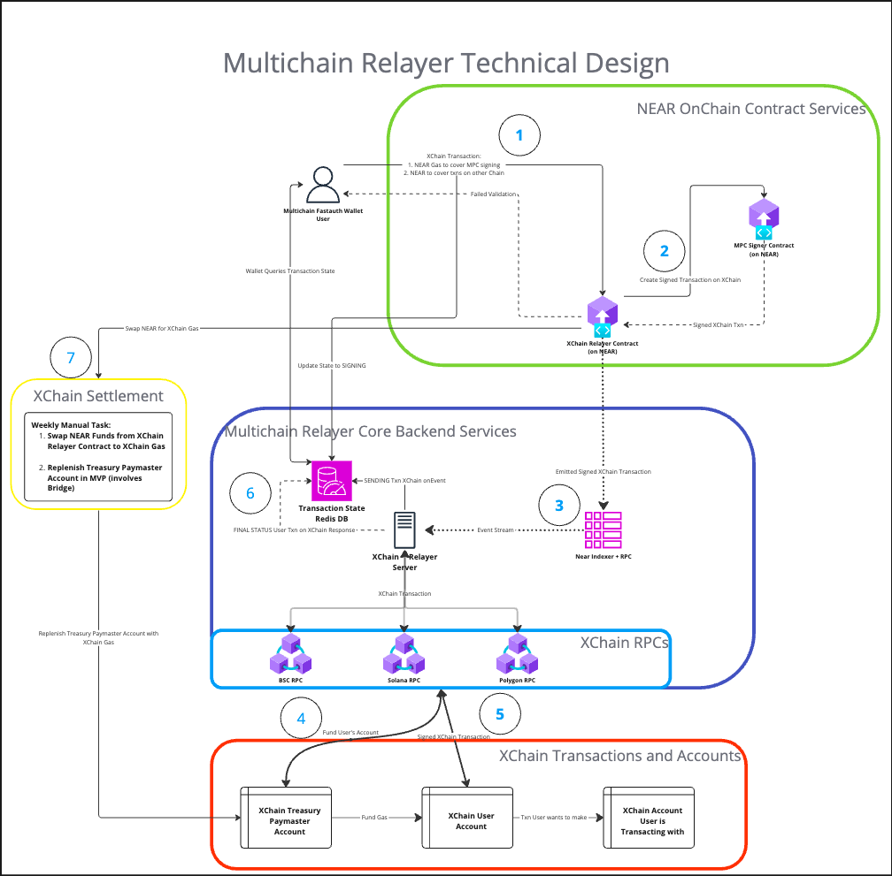

# multichain-relayer-server
Pagoda Implementation of Multichain Relayer Server facilitating cross chain transactions 

## Run
```shell
cargo build --release
./target/release/multichain-relayer-server --accounts nomnomnom.testnet --block-height 153978819 testnet
```
Replace: 
1. `nomnomnom.testnet` with the relayer contract account id
2. `153978819` with the current blockheight
3. `testnet` with either testnet or mainnet

## Components
This server interacts with 3 other components:
1. Indexer 
   - The implementation uses [near-lake](https://github.com/near/near-lake-framework-rs) based on [this example](https://github.com/near-examples/indexer-tx-watcher-example-lake/tree/main)
2. Redis Instance
    - Contains the state of the transaction (SIGNING, SENDING, FINAL_STATUS), which the relayer server updates.
3. RPCs
    - EVM RPCs will be interacted with using the [alloy](https://github.com/alloy-rs/) crate. Initially we will connect to public RPCs
    - TODO Solana crate and RPC providers.

## Functionality
1. logs from the relayer onchain contract are emitted which gets picked up by the indexer. This triggers 2 events:
   1. Updates the state of the Transaction State Redis DB to SENDING with associated metadata 
   2. Gets the XChain Signed Transaction in hexadecimal binary format and associated metadata (chainId, gas, xchain accountId).
2. Funding the user's xchain account with gas from the paymaster treasury account
3. Sending the raw signed transaction (in hexadecimal in EVM case)
4. Updating the state of the Transaction State Redis DB to FINAL_STATUS with associated metadata


## Technical Design
The Technical Design is detailed in https://docs.google.com/document/d/1ZvfiVDXSykYsdH8v816G-V5OizAUtpw9WAh1ihwz908/edit

Below is a Design Diagram of the entire multichain relayer system. 
This server repo focuses on the purple/blue Multichain Relayer Core Backend Services Box in the middle and the connections to the XChain systems in the red box via RPCs.  
